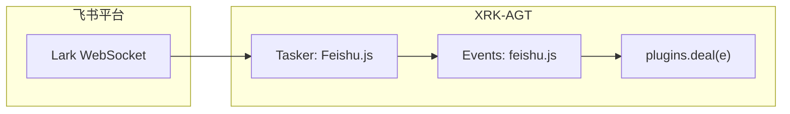

<div align="center">

# 🐦 Feishu-Core

**XRK-AGT 飞书通道：基于 @larksuiteoapi/node-sdk 连接飞书，将 Lark 消息标准化为 XRK 事件，与插件 / 事件链无缝对接。**

[](https://github.com/sunflowermm/XRK-AGT)
[](https://www.npmjs.com/package/@larksuiteoapi/node-sdk)
[](./LICENSE)

</div>

---

## 📦 项目定位

- **所在位置**：
  - 在 XRK-AGT 仓库内作为 Core 模块：放入 `core/Feishu-Core/` 即可
- **职责**：
  - 提供 **飞书事件接入**（Tasker：`Feishu.js`）与 **事件监听**（`events/feishu.js`）
  - 将 Lark WebSocket 事件标准化为 `feishu.message` / `feishu.notice`，经 `plugins.deal(e)` 供插件使用
  - 通过 `commonconfig/feishu.js` + `data/server_bots/{port}/feishu.yaml` 提供 **策略、发送、多账号等配置托管**

---

## 🗂️ 目录结构

```text
Feishu-Core/
├── README.md
├── .gitignore
├── commonconfig/
│   ├── feishu.js              # 配置 Schema（策略、发送、多账号等）
│   └── feishu.default.yaml    # 默认配置参考；feishu.js 在 read() 时若目标不存在则从此文件复制到 data/server_bots/{port}/feishu.yaml，不写入项目根或底层目录
├── tasker/
│   └── Feishu.js              # Tasker：Lark WebSocket → 标准化事件
├── events/
│   └── feishu.js              # 事件监听：去重、挂载 e.reply → plugins.deal
└── plugin/                    # 可选业务插件（若有）
```

---

## ⚙️ 配置与启用

### 1. 配置文件路径

- **实际生效**：`data/server_bots/{port}/feishu.yaml`  
  - 由 `commonconfig/feishu.js` 中的 `filePath`（或动态函数）决定，与 `src/infrastructure/config/config-constants.js` 中通道配置约定一致。
  - 通过 `global.ConfigManager.get('feishu')` 获取配置实例，可在 **Web 控制台** 编辑。
- **默认配置**：本 Core 内参考文件为 **`commonconfig/feishu.default.yaml`**。`feishu.js` 在 `read()` 时若 **`data/server_bots/{port}/feishu.yaml` 不存在**，会**从本目录的 feishu.default.yaml 复制到该路径**并再读，不污染底层目录。

### 2. 关键字段

配置字段见 `commonconfig/feishu.js` 的 schema（策略、发送、多账号等），与常见飞书通道 schema 对齐，便于迁移。

> 修改配置后，重启 XRK-AGT 或触发配置热加载即可生效。

---

## 🔄 事件链路一览



**事件流说明：**

1. **Tasker**（`tasker/Feishu.js`）：接收 Lark WebSocket 事件 → 策略过滤 → 标准化 → `Bot.em("feishu.message" | "feishu.notice", data)`
2. **事件监听**（`events/feishu.js`）：订阅上述事件 → 去重、挂载 `e.reply` → `plugins.deal(e)`
3. **插件**：通过 `plugins.deal` 统一处理；`event: "message"` 可收到飞书消息，`event: "feishu.message"` 可仅匹配飞书

底层无 Feishu 专用分支，使用通用 EventNormalizer 与插件 loader（含 `record` / `file` 段兼容）。

---

## 📋 事件与字段

| 飞书事件 | XRK 事件 | 说明 |
|----------|----------|------|
| `im.message.receive_v1` | `feishu.message` | 消息（mentionedBot、mentionTargets、mentionMessageBody、全媒体） |
| `im.message.message_read_v1` | — | 已读，不转发 |
| `im.chat.member.bot.added_v1` / `bot.deleted_v1` | `feishu.notice` | 机器人被加群 / 移出群 |

消息字段：`post_type`、`message_type`(group/private)、`raw_message`、`message`(段数组)、`group_id` / `user_id`、`sender`、`feishu_*` 等，与 OneBot 风格对齐，供插件使用。

---

## 🧱 与 XRK-AGT 框架的关系

本 Core 仅依赖 XRK-AGT 已有能力，不侵入基础设施层实现：

| 能力 | 说明 |
|------|------|
| **commonconfig 加载** | `src/infrastructure/commonconfig/loader.js` 通过 `paths.getCoreSubDirs('commonconfig')` 得到各 `core/*/commonconfig/`，加载该目录下 `*.js`，以文件名（不含扩展名）为 key 存入；`feishu.js` → key `feishu`，通过 `global.ConfigManager.get('feishu')` 访问。 |
| **Tasker 加载** | `src/infrastructure/tasker/loader.js` 扫描各 `core/*/tasker/*.js`，对每个模块执行 `mod.register(bot)`；`Feishu.js` 在 `register(bot)` 中向 `bot.tasker` 注册适配器。 |
| **Events 加载** | `src/infrastructure/listener/loader.js` 通过 `paths.getCoreSubDirs('events')` 得到各 `core/*/events/`，加载其下 `*.js`，实例化监听器后通过 `bot.on(prefix + event, handler)` 订阅；`feishu.js` 订阅 `feishu.message` / `feishu.notice` 等。 |
| **全局对象** | 使用 `Bot`、`global.ConfigManager`（即 ConfigLoader 实例）、插件基类，遵循 XRK-AGT 约定。 |

---

## 📦 依赖

仅需 **@larksuiteoapi/node-sdk**。在项目根或本 Core 目录执行：

```bash
pnpm install
```

---

## 🔗 相关链接

- **XRK-AGT 主项目**：[XRK-AGT](https://github.com/sunflowermm/XRK-AGT)
- **飞书开放平台**：[Lark / 飞书开发文档](https://open.feishu.cn/document/)

---

## 📄 许可证

本项目基于 **MIT License** 开源；若仓库内无 LICENSE 文件，以主项目 XRK-AGT 的许可证为准。
