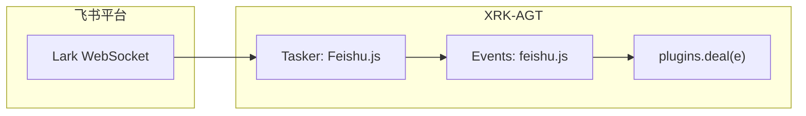

<div align="center">

# 🐦 Feishu-Core

**XRK-AGT 飞书通道：基于 @larksuiteoapi/node-sdk 连接飞书，将 Lark 消息标准化为 XRK 事件，与插件 / 事件链无缝对接。**

[](https://github.com/sunflowermm/XRK-AGT)
[](https://www.npmjs.com/package/@larksuiteoapi/node-sdk)
[](./LICENSE)

</div>

---

## 📦 项目定位

- **所在位置**：
  - 在 XRK-AGT 仓库内作为 Core 模块：放入 `core/Feishu-Core/` 即可
- **职责**：
  - 提供 **飞书事件接入**（Tasker：`Feishu.js`）与 **事件监听**（`events/feishu.js`）
  - 将 Lark WebSocket 事件标准化为 `feishu.message` / `feishu.notice`，经 `plugins.deal(e)` 供插件使用
  - 通过 `commonconfig/feishu.js` + `data/server_bots/{port}/feishu.yaml` 提供 **策略、发送、多账号等配置托管**

---

## 🗂️ 目录结构

```text
Feishu-Core/
├── README.md
├── LICENSE
├── .gitignore
├── commonconfig/
│   ├── feishu.js              # 配置 Schema（策略、发送、多账号等）
│   └── feishu.default.yaml    # 默认配置参考；feishu.js 在 read() 时若目标不存在则从此文件复制到 data/server_bots/{port}/feishu.yaml，不写入项目根或底层目录
├── tasker/
│   └── Feishu.js              # Tasker：Lark WebSocket → 标准化事件
├── events/
│   └── feishu.js              # 事件监听：去重、挂载 e.reply → plugins.deal
└── plugin/                    # 可选业务插件（若有）
```

---

## ⚙️ 配置与启用

### 1. 配置文件路径

- **实际生效**：`data/server_bots/{port}/feishu.yaml`  
  - 由 `commonconfig/feishu.js` 中的 `filePath`（或动态函数）决定，与 `src/infrastructure/config/config-constants.js` 中通道配置约定一致。
  - 通过 `global.ConfigManager.get('feishu')` 获取配置实例，可在 **Web 控制台** 编辑。
- **默认配置**：本 Core 内参考文件为 **`commonconfig/feishu.default.yaml`**。`feishu.js` 在 `read()` 时若 **`data/server_bots/{port}/feishu.yaml` 不存在**，会**从本目录的 feishu.default.yaml 复制到该路径**并再读，不污染底层目录。

### 2. 关键字段

配置字段见 `commonconfig/feishu.js` 的 schema（策略、发送、多账号等），与常见飞书通道 schema 对齐，便于迁移。

> 修改配置后，重启 XRK-AGT 或触发配置热加载即可生效。

---

## 与开放平台 API 的对齐说明（以代码为准）

本 Core 中 **与飞书服务端 API 直接相关的调用**均通过 `@larksuiteoapi/node-sdk` 的 `Client` / `WSClient` / `EventDispatcher` 完成，与官方文档中的路径与参数一致，主要包括：

| 能力 | 说明 |
|------|------|
| 长连接收事件 | `WSClient` + `EventDispatcher`，对应[长连接模式](https://open.feishu.cn/document/uAjLw4CM/ukTMukTMukTM/event-subscription-guide/long-connection-mode) |
| 发消息 / 回复 | `client.im.message.create`、`client.im.message.reply`，对应 [发送消息](https://open.feishu.cn/document/server-docs/im-v1/message/create)、[回复消息](https://open.feishu.cn/document/uAjLw4CM/ukTMukTMukTM/reference/im-v1/message/reply) |
| 机器人信息 | `GET /open-apis/bot/v3/info`（`client.request`），用于解析 `data.bot.open_id`，对应[获取机器人信息](https://open.feishu.cn/document/server-docs/bot-v3/bot-info) |

**未在本 Core 内完整接入的能力**：`connectionMode: webhook` 时，控制台仅打印提示，需自行用 SDK 的 `adaptExpress` / `adaptDefault` 等挂载 HTTP 回调（见 node-sdk README「处理事件」）。若你希望与 XRK 主 HTTP 服务打通，可在业务层扩展，本 Core 不修改 `src/` 底层。

**智能助手 / 沙箱文档**（[从自然语言到可执行代码](https://open.feishu.cn/document/ukTMukTMukTM/ukDNz4SO0MjL5QzM/AI-assistant-code-generation-guide)）描述的是开放平台内**代码沙箱**环境与预装 SDK 版本，与生产环境 XRK 进程无关；生产侧只需保证本 Core 已安装 `@larksuiteoapi/node-sdk` 且应用权限与事件订阅配置正确。

---

## 开放平台：需要申请什么

### 1. 应用类型与能力

1. 在 [飞书开放平台](https://open.feishu.cn/app/) 创建 **企业自建应用**（与文档一致）。
2. 在应用能力中 **启用「机器人」**（[如何启用机器人能力](https://open.feishu.cn/document/uAjLw4CM/ugTN1YjL4UTN24CO1UjN/trouble-shooting/how-to-enable-bot-ability)）。
3. 在 **权限管理** 中申请与 **即时消息 IM** 相关的权限，至少需覆盖：
   - **接收**用户发给机器人的消息（单聊/群聊）；
   - **以机器人身份发送消息**（回复用户、发群消息）。  
   具体权限名称以控制台列表为准，可检索「消息」「im」「im:message」等；权威说明见 [权限列表](https://open.feishu.cn/document/server-docs/application-scope-list) 与应用后台「权限」页。
4. 私聊场景若提示无可用性，需遵守飞书 **[可用性](https://open.feishu.cn/document/home/introduction-to-scope-and-authorization/availability)** 规则（例如用户需先与机器人产生可交互会话）。
5. 完成版本发布与可用范围（测试/正式）以你企业后台要求为准。

### 2. 事件订阅（长连接，推荐）

本 Core 默认使用 **`connectionMode: websocket`**，与 SDK **长连接**一致，**无需**配置公网回调 URL。

在开放平台 **事件与回调** 中：

1. 选择 **使用长连接接收事件**（或等价选项，以控制台为准）。
2. 订阅下列 **至少** 与本 Core 一致的事件（见 `tasker/Feishu.js` 中 `eventDispatcher.register`）：

| 事件 | 用途 |
|------|------|
| `im.message.receive_v1` | 用户消息 → `feishu.message` |
| `im.chat.member.bot.added_v1` | 机器人入群 → `feishu.notice`（`bot_added`） |
| `im.chat.member.bot.deleted_v1` | 机器人被移出群 → `feishu.notice`（`bot_deleted`） |

可选：`im.message.message_read_v1` 本 Core 已注册但**不向上转发**（空处理）。

3. **加密与校验**：若在控制台开启了 **Encrypt Key** / **Verification Token**，将同一值填入下方配置 `encryptKey`、`verificationToken`。长连接建立后事件多为明文，但保留与后台一致可避免后续切换加密或混用 Webhook 时出错。

### 3. 凭证从哪里抄

在应用 **凭证与基础信息**（或「基础信息」）页面可看到：

- **App ID** → 配置项 `appId`（通常形如 `cli_xxx`）。
- **App Secret** → `appSecret`，或使用 `appSecretFile` 指向仅服务器可读的文件，避免明文进仓库。

---

## 配置填写：与 `feishu.yaml` 字段对照

生效路径：`data/server_bots/{port}/feishu.yaml`（`{port}` 为当前 XRK HTTP 端口，与 `node app server <port>` 一致）。

### 必配（使用本 Core 默认 WebSocket 时）

| 配置项 | 填写说明 |
|--------|----------|
| `enabled` | `true` 才会在 Tasker `load()` 时连接飞书。 |
| `appId` / `appSecret`（或 `appSecretFile`） | 与开放平台应用凭证一致；多账号时放在 `accounts.<id>` 下，顶层可共用策略字段。 |
| `domain` | `feishu`：国内飞书；`lark`：国际版 Lark，与开放平台应用区域一致。 |
| `connectionMode` | 请填 **`websocket`**。选 `webhook` 时当前 Core **不会**自动起 HTTP 回调，仅告警日志。 |

### 建议配置（与事件安全一致）

| 配置项 | 填写说明 |
|--------|----------|
| `encryptKey` | 与事件订阅里 **Encrypt Key** 一致（若启用加密推送）。 |
| `verificationToken` | 与事件订阅 **Verification Token** 一致；Webhook 场景必需，长连接建议同步填写。 |

### 策略与行为（`tasker/Feishu.js` 已使用）

| 配置项 | 说明 |
|--------|------|
| `dmPolicy` / `groupPolicy` / `allowFrom` / `groupAllowFrom` | 私聊/群聊是否处理、白名单（值为用户 `open_id`，可配 `*`）。 |
| `requireMention` / `groups` | 群内是否必须 @ 机器人；`groups` 可按群 `chat_id` 覆盖。 |
| `replyInThread` | `enabled` 时，群内回复使用 `reply_in_thread`（话题内回复），与[回复消息](https://open.feishu.cn/document/uAjLw4CM/ukTMukTMukTM/reference/im-v1/message/reply)一致。 |
| `responsePrefix` | 发送内容前缀。 |
| `renderMode` | `raw`：纯文本 `msg_type: text`；`auto` 或 `card`：富文本 `post` + `zh_cn` 下单段 `tag: md`（与[富文本 post 说明](https://open.feishu.cn/document/uAjLw4CM/ukTMukTMukTM/im-v1/message/create_json)一致）。 |
| `httpTimeoutMs` | 调飞书 HTTP API 的超时（毫秒），作用于 `Client` 的 `httpInstance`。 |
| `defaultAccount` / `accounts` | 多账号时指定默认账号 id 及各账号的 `appId`/`appSecret` 等。 |

### Schema 中存在、当前 Tasker 未读取的字段

以下字段在 `commonconfig/feishu.js` 中可见，但 **`tasker/Feishu.js` 尚未消费**（保留给后续扩展或其它模块使用），不必为「跑通收发消息」而填写：

`topicSessionMode`、`groupSessionScope`、`reactionNotifications`、`historyLimit`、`dmHistoryLimit`、`textChunkLimit`、`chunkMode`、`mediaMaxMb`、`blockStreaming`、`streaming`、`typingIndicator`、`resolveSenderNames`、`tools`、`heartbeat`、`blockStreamingCoalesce`、`webhookPath`、`webhookPort`、`botName` 等。

若文档与代码不一致，**以 `core/Feishu-Core/tasker/Feishu.js` 与 `events/feishu.js` 为准**。

---

## 🔄 事件链路一览



**事件流说明：**

1. **Tasker**（`tasker/Feishu.js`）：接收 Lark WebSocket 事件 → 策略过滤 → 标准化 → `Bot.em("feishu.message" | "feishu.notice", data)`
2. **事件监听**（`events/feishu.js`）：订阅上述事件 → 去重、挂载 `e.reply` → `plugins.deal(e)`
3. **插件**：通过 `plugins.deal` 统一处理；`event: "message"` 可收到飞书消息，`event: "feishu.message"` 可仅匹配飞书

底层无 Feishu 专用分支，使用通用 EventNormalizer 与插件 loader（含 `record` / `file` 段兼容）。

---

## 📋 事件与字段

| 飞书事件 | XRK 事件 | 说明 |
|----------|----------|------|
| `im.message.receive_v1` | `feishu.message` | 消息（mentionedBot、mentionTargets、mentionMessageBody、全媒体） |
| `im.message.message_read_v1` | — | 已读，不转发 |
| `im.chat.member.bot.added_v1` / `bot.deleted_v1` | `feishu.notice` | 机器人被加群 / 移出群 |

消息字段：`post_type`、`message_type`(group/private)、`raw_message`、`message`(段数组)、`group_id` / `user_id`、`sender`、`feishu_*` 等，与 OneBot 风格对齐，供插件使用。

---

## 🧱 与 XRK-AGT 框架的关系

本 Core 仅依赖 XRK-AGT 已有能力，不侵入基础设施层实现：

| 能力 | 说明 |
|------|------|
| **commonconfig 加载** | `src/infrastructure/commonconfig/loader.js` 通过 `paths.getCoreSubDirs('commonconfig')` 得到各 `core/*/commonconfig/`，加载该目录下 `*.js`，以文件名（不含扩展名）为 key 存入；`feishu.js` → key `feishu`，通过 `global.ConfigManager.get('feishu')` 访问。 |
| **Tasker 加载** | `src/infrastructure/tasker/loader.js` 扫描各 `core/*/tasker/*.js` 并 import 模块；`Feishu.js` 在模块顶层向 `Bot.tasker.push` 注册，框架随后对每个 tasker 调用 `load()`。 |
| **Events 加载** | `src/infrastructure/listener/loader.js` 通过 `paths.getCoreSubDirs('events')` 得到各 `core/*/events/`，加载其下 `*.js`，实例化监听器后通过 `bot.on(prefix + event, handler)` 订阅；`feishu.js` 订阅 `feishu.message` / `feishu.notice` 等。 |
| **全局对象** | 使用 `Bot`、`global.ConfigManager`（即 ConfigLoader 实例）、插件基类，遵循 XRK-AGT 约定。 |

---

## 📦 依赖

仅需 **@larksuiteoapi/node-sdk**。在项目根或本 Core 目录执行：

```bash
pnpm install
```

---

## 🔗 相关链接

- **XRK-AGT 主项目**：[XRK-AGT](https://github.com/sunflowermm/XRK-AGT)
- **飞书开发文档首页**：[开放平台文档](https://open.feishu.cn/document/)
- **长连接事件**：[事件订阅—长连接模式](https://open.feishu.cn/document/uAjLw4CM/ukTMukTMukTM/event-subscription-guide/long-connection-mode)
- **发送 / 回复消息**：[发送消息](https://open.feishu.cn/document/server-docs/im-v1/message/create) · [回复消息](https://open.feishu.cn/document/uAjLw4CM/ukTMukTMukTM/reference/im-v1/message/reply)
- **机器人信息**：[获取机器人信息](https://open.feishu.cn/document/server-docs/bot-v3/bot-info)
- **node-sdk**：[README（中文）](https://github.com/larksuite/node-sdk/blob/main/README.zh.md) · [npm](https://www.npmjs.com/package/@larksuiteoapi/node-sdk)

---

## 📄 许可证

本 Core 采用 **MIT License** 开源，见 [LICENSE](./LICENSE)。若主项目 XRK-AGT 另有约定，以主项目为准。
